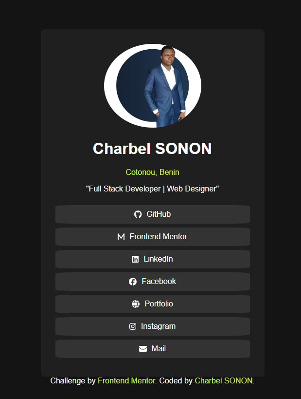

# Frontend Mentor - Social links profile solution

This is a solution to the [Social links profile challenge on Frontend Mentor](https://www.frontendmentor.io/challenges/social-links-profile-UG32l9m6dQ). Frontend Mentor challenges help you improve your coding skills by building realistic projects. 

## Table of contents

- [Frontend Mentor - Social links profile solution](#frontend-mentor---social-links-profile-solution)
  - [Table of contents](#table-of-contents)
  - [Overview](#overview)
    - [The challenge](#the-challenge)
    - [Screenshot](#screenshot)
    - [Links](#links)
  - [My process](#my-process)
    - [Built with](#built-with)
    - [Useful resources](#useful-resources)
  - [Author](#author)

## Overview

### The challenge

Users should be able to:

- See hover and focus states for all interactive elements on the page

### Screenshot

### Links

- Solution URL: [CODE](https://github.com/AsKing07/social-links-profils)
- Live Site URL: [DEMO](https://social-links-profils.vercel.app/)
- 
## My process

### Built with

- [React](https://reactjs.org/) - JS library
- CSS custom properties

### Useful resources

- [Border-Radius-Previewer](https://asking07.github.io/Border-Radius-Previewer/) - This helped me for preview border radius effect
- [Vercel](https://vercel.com) - This helps me to deploy

## Author

- Website - [Charbel SONON](https://cutt.ly/charbeldev)
- Frontend Mentor - [@AsKing07](https://www.frontendmentor.io/profile/AsKing07)
